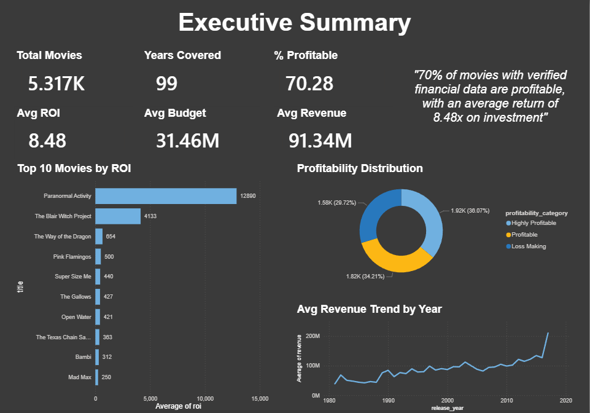
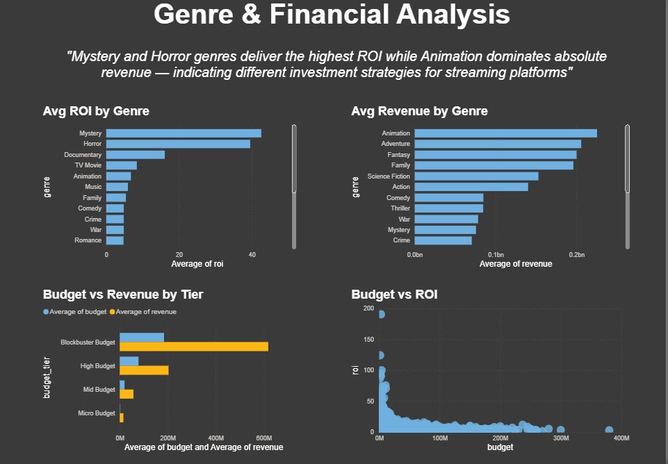
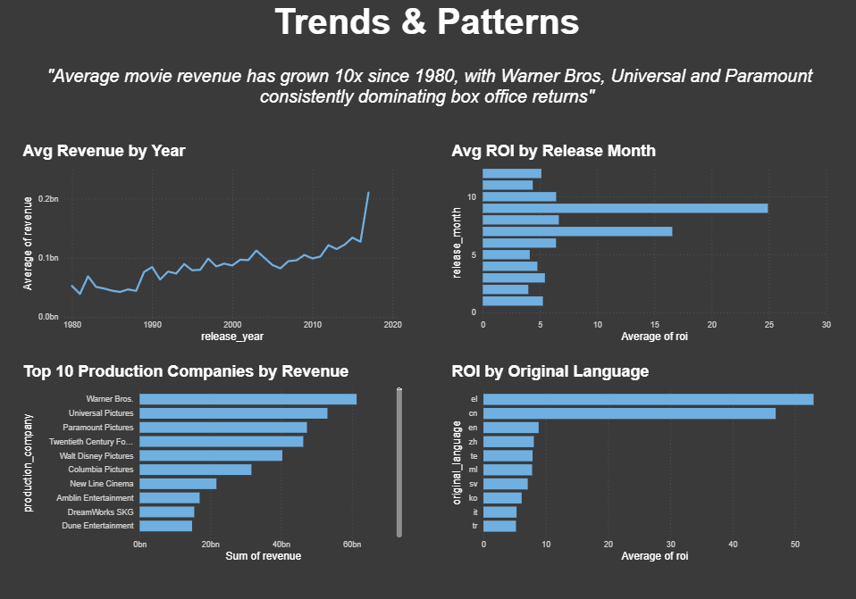
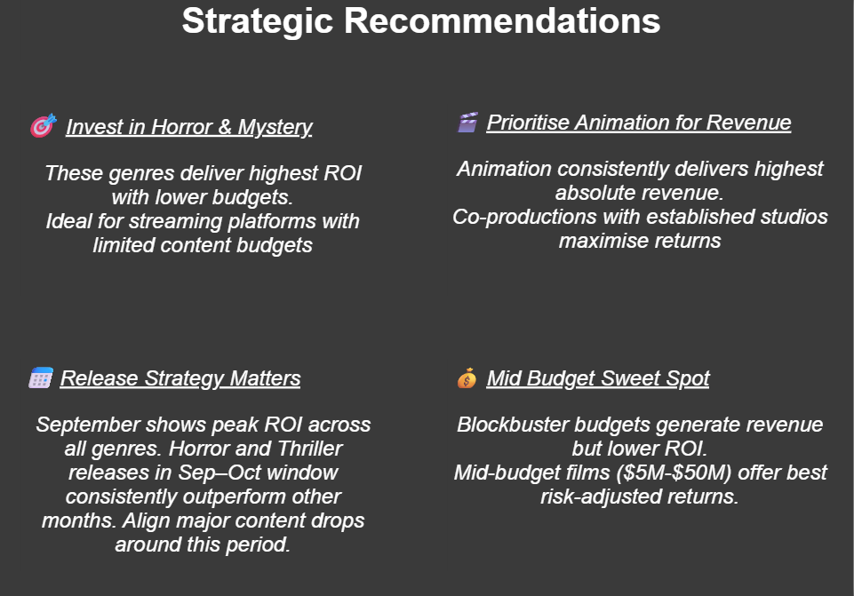

# 🎬 Movie Industry Analysis — What Makes a Film Financially Successful?

## Project Overview
A complete end-to-end data analysis case study examining 45,483 movies 
to identify financial success patterns for streaming platform content 
strategy decisions.

**Tools Used:** SQL · Google BigQuery · Power BI · Google Sheets  
**Dataset:** Movies Dataset by Rounak Banik (Kaggle) — 45,483 movies  
**Role Context:** Business Analyst perspective — data to business recommendations  

---

## Business Problem
> *"What should a streaming platform greenlight next to maximise 
> return on investment?"*

A streaming platform's content strategy team needs data-driven guidance 
on which genres, budget tiers, and release windows deliver the strongest 
financial returns. This analysis provides actionable recommendations 
backed by historical movie industry data.

**Stakeholder:** Head of Content Strategy  
**Objective:** Identify financially successful movie patterns to guide 
content investment decisions  
**Success Metric:** ROI (Revenue / Budget ratio)

---

## Dataset
- **Source:** [Movies Dataset — Kaggle](https://www.kaggle.com/datasets/rounakbanik/the-movies-dataset)
- **Author:** Rounak Banik
- **License:** CC0 (Public Domain)
- **Raw Dataset:** 45,483 movies
- **Analysis Dataset:** 5,317 movies with verified financial data
- **Key Columns:** budget, revenue, genres, release_date, runtime, 
  vote_average, production_companies, original_language

> **Data Quality Note:** Only 11.7% of movies in the dataset had 
> complete budget and revenue data — consistent with industry norms 
> where financial reporting is limited to major studio productions. 
> All analysis is based on this verified subset.

---

## Methodology

### 1. Data Collection
- Downloaded movies_metadata.csv and credits.csv from Kaggle
- Loaded into Google BigQuery (project: axial-autonomy-478712-i3)

### 2. Data Cleaning (SQL — BigQuery)
- Removed rows where budget = 0 or revenue = 0
- Filtered out entries with missing release dates
- Excluded budgets under $10,000 (test/fake entries)
- Parsed JSON-formatted genres and production_companies columns 
  using REGEXP_EXTRACT

### 3. Feature Engineering
Created the following calculated columns:
- `roi` = revenue / budget
- `profit` = revenue - budget
- `release_year` and `release_month` extracted from release_date
- `budget_tier` — Micro (<$5M) / Mid ($5–50M) / High ($50–150M) 
  / Blockbuster (>$150M)
- `profitability_category` — Highly Profitable / Profitable / Loss Making

### 4. Analysis
- Genre ROI and revenue analysis
- Budget tier performance comparison
- Release month impact on ROI
- Production company revenue ranking
- Revenue trends over time (1980–2020)

### 5. Visualisation
- Built 4-page interactive Power BI dashboard
- Connected directly to BigQuery via live connection

---

## Key Findings

### 💰 Financial Overview
| Metric | Value |
|--------|-------|
| Total Movies Analysed | 5,317 |
| Average ROI | 8.48x |
| Average Budget | $31.46M |
| Average Revenue | $91.34M |
| % Profitable Movies | 70.28% |
| Years Covered | 99 |

### 🎭 Genre Analysis
| Finding | Detail |
|---------|--------|
| Highest ROI Genre | Mystery (42.56x avg ROI) |
| Highest Revenue Genre | Animation ($2.25BN avg revenue) |
| Most Capital Efficient | Horror — high ROI at low budget |
| Lowest ROI Genre | Romance/Thriller |

### 📅 Release Timing
- **September** delivers the highest average ROI across all genres
- Horror and Thriller releases in the Sep–Oct window 
  consistently outperform other months
- Aligns with Halloween season demand spike

### 🏢 Production Landscape
- **Warner Bros** leads in total cumulative revenue
- Universal Pictures and Paramount Pictures follow closely
- Top 3 studios account for a disproportionate share of 
  total industry revenue

### 📈 Revenue Trends
- Average movie revenue peaked in **2017 at $210.28M**
- Total industry revenue peaked in **2016 at $29.62BN**
- Revenue has grown approximately **10x since 1980**
- Sharp growth visible post-2000 driven by global distribution

### 💡 Budget vs ROI Insight
- **Micro budget films** deliver highest ROI but lowest absolute revenue
- **Blockbuster films** deliver highest revenue but lower ROI
- **Mid-budget ($5M–$50M)** offers the best risk-adjusted returns
- Paranormal Activity: $15K budget → $193M revenue = 12,890x ROI 
  (highest in dataset)

---

## Strategic Recommendations

### 1. 🎯 Invest in Horror & Mystery for Capital Efficiency
Mystery delivers 42.56x average ROI and Horror consistently 
outperforms on low budgets. For streaming platforms with 
limited content budgets, these genres offer maximum return 
per dollar invested.

### 2. 🎬 Prioritise Animation for Absolute Revenue
Animation averages $2.25BN in revenue — the highest of any genre. 
Co-productions with established studios (Disney, Pixar model) 
maximise returns. Ideal for platforms targeting family audiences 
and broad demographic reach.

### 3. 📅 Align Major Releases to September Window
September shows peak ROI across genres. Streaming platforms should 
schedule premium content drops in August–September to capitalise 
on this seasonal demand pattern — particularly for Horror and 
Thriller content ahead of Halloween.

### 4. 💰 Target Mid-Budget Productions ($5M–$50M)
Blockbuster budgets (>$150M) generate the highest absolute revenue 
but deliver lower ROI than mid-budget films. A portfolio approach 
— anchored by mid-budget productions with selective blockbuster 
investments — optimises risk-adjusted returns for content strategy.

---

## Dashboard
Built in Power BI — 4 pages:

**Page 1 — Executive Summary**
KPI overview, Top 10 movies by ROI, Profitability distribution, 
Revenue trend

**Page 2 — Genre & Financial Analysis**  
ROI by genre, Revenue by genre, Budget vs Revenue by tier, 
Budget vs ROI scatter

**Page 3 — Trends & Patterns**
Revenue by year, ROI by release month, Top 10 production companies, 
ROI by language

**Page 4 — Strategic Recommendations**
4 data-backed content strategy recommendations

### Dashboard Screenshots
<!-- Add your screenshots below -->

---

## Project Structure

## Project Structure
movie-analysis-case-study/
│
├── README.md
├── screenshots/
│   ├── page1_executive_summary.png
│   ├── page2_genre_analysis.png
│   ├── page3_trends.png
│   └── page4_recommendations.png
├── sql/
│   ├── 01_data_cleaning.sql
│   ├── 02_feature_engineering.sql
│   ├── 03_genre_parsing.sql
│   └── 04_production_company_parsing.sql
├── dashboard/
│   └── Movie_Analysis_Dashboard.pbix
└── data/
└── (Dataset available on Kaggle — link above)

---

## About
**Aryan** | Aspiring Business Analyst  
Google Data Analytics Certificate | SQL | BigQuery | Power BI  

[LinkedIn](www.linkedin.com/in/aryan-shaikh-802337307)

*This is Case Study 3 of my BA portfolio. Previous projects include 
Cyclistic Bike Share Analysis and Bellabeat Health Data Analysis.*
